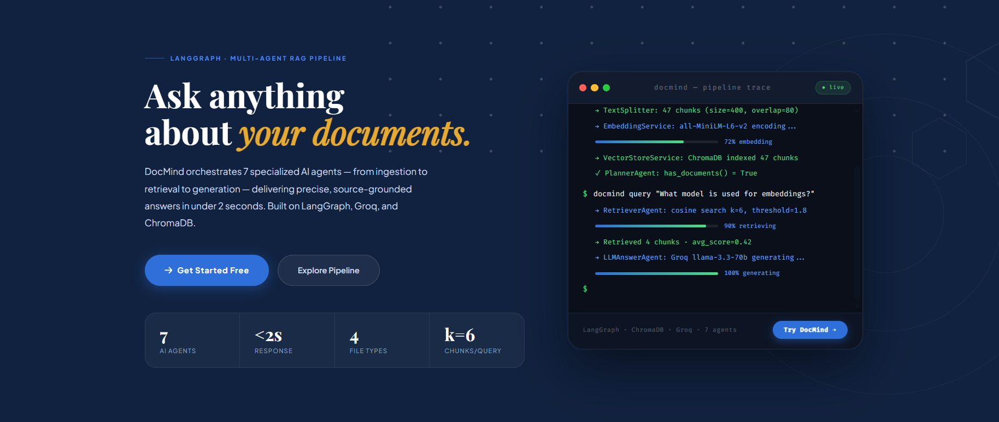

<div align="center">

<br/>

```
██████╗  ██████╗  ██████╗███╗   ███╗██╗███╗   ██╗██████╗
██╔══██╗██╔═══██╗██╔════╝████╗ ████║██║████╗  ██║██╔══██╗
██║  ██║██║   ██║██║     ██╔████╔██║██║██╔██╗ ██║██║  ██║
██║  ██║██║   ██║██║     ██║╚██╔╝██║██║██║╚██╗██║██║  ██║
██████╔╝╚██████╔╝╚██████╗██║ ╚═╝ ██║██║██║ ╚████║██████╔╝
╚═════╝  ╚═════╝  ╚═════╝╚═╝     ╚═╝╚═╝╚═╝  ╚═══╝╚═════╝
```

### *Intelligent Multi-Agent RAG Document Intelligence System*

<br/>

[](https://python.org)
[](https://github.com/langchain-ai/langgraph)
[](https://groq.com)
[](https://www.trychroma.com)
[](https://huggingface.co)
[](https://fastapi.tiangolo.com)

<br/>

> **DocMind** is a production-grade, multi-agent RAG pipeline that lets you upload documents and ask questions about them — naturally, accurately, and with automatic fallback to Wikipedia when the document doesn't have the answer.

## 🎥 Demo (Click below to watch the full system in action 👇)

[](https://drive.google.com/file/d/1MbHV2PKCYlB0PFInQAm6WbY476M-L6gw/view?usp=sharing)

---

</div>

## ⚡ What Makes DocMind Different

Unlike simple chatbot wrappers, DocMind is a **fully orchestrated multi-agent system** built on LangGraph's stateful DAG. Every component has a single responsibility. Every failure has a recovery path. The system **always returns an answer** — from your document, from Wikipedia, or with a graceful error message.

```
Traditional RAG:    User → Embed → Search → LLM → Answer
                         (one straight line, no fallback, no routing)

DocMind:            User → Router → Ingest → Plan → Retrieve → LLM
                                                          ↓         ↓
                                                    Wikipedia ← Fallback Gate
                                                          ↓
                                                       Always answers
```

---

## ✨ Core Capabilities

| Capability | Detail |
|---|---|
| 📁 **Multi-format ingestion** | PDF, DOCX, TXT files and web URLs — all unified |
| 🔍 **Semantic vector search** | Cosine similarity via ChromaDB + `all-MiniLM-L6-v2` |
| 🤖 **LLM-powered answers** | Groq `llama-3.3-70b-versatile` grounded strictly in document context |
| 🌐 **Automatic Wikipedia fallback** | Triggers when the document doesn't contain the answer |
| 🧠 **Conversational memory** | Sliding 5-turn history for coherent multi-turn sessions |
| 🔄 **Stateful agent graph** | Full LangGraph `StateGraph` with typed conditional routing |
| 🛡️ **Resilience by design** | Every failure path has a graceful recovery — zero dead ends |
| 🔌 **Singleton services** | All heavy models loaded once and shared across the entire pipeline |
| 🔒 **Input validation layer** | URL, file extension, query, and text sanitization before processing |
| 📊 **Two-gate retrieval scoring** | Individual chunk filter + aggregate quality gate for precision |

---

## 🏗️ System Architecture

DocMind is structured across **four clean, decoupled layers**:

```
╔═══════════════════════════════════════════════════════════════════════╗
║  AGENT LAYER                                                          ║
║  ┌──────────┐  ┌───────────┐  ┌─────────┐  ┌───────────┐            ║
║  │ToolRouter│→ │ Ingestion │→ │ Planner │→ │ Retriever │            ║
║  └──────────┘  └───────────┘  └─────────┘  └───────────┘            ║
║                                                    │                  ║
║                               ┌────────────────────┤                  ║
║                               ↓                    ↓                  ║
║                          ┌─────────┐          ┌──────────┐           ║
║                          │LLMAnswer│          │ Fallback │           ║
║                          └─────────┘          └──────────┘           ║
║                               │                    │                  ║
║                               └──────────┬─────────┘                 ║
║                                          ↓                           ║
║                                    ┌──────────┐                      ║
║                                    │ Executor │ → END                ║
║                                    └──────────┘                      ║
╠═══════════════════════════════════════════════════════════════════════╣
║  WORKFLOW LAYER                                                       ║
║  graph.py (StateGraph)  ·  edges.py (routing functions)              ║
╠═══════════════════════════════════════════════════════════════════════╣
║  SERVICE LAYER                                                        ║
║  LLMService  ·  EmbeddingService  ·  VectorStoreService  ·  Wiki     ║
╠═══════════════════════════════════════════════════════════════════════╣
║  TOOL LAYER                                                           ║
║  DocumentLoader (PDF·DOCX·TXT·URL)  ·  TextSplitter                  ║
╚═══════════════════════════════════════════════════════════════════════╝
```

---

## 🔄 Complete Workflow & Routing Logic

```
                     ╔═══════════════════════╗
                     ║    USER QUERY INPUT    ║
                     ╚══════════╦════════════╝
                                ║
                     ╔══════════▼════════════╗
                     ║   TOOL ROUTER AGENT   ║
                     ║  Inspects file_content║
                     ╚══════════╦════════════╝
                                ║
             ╔══════════════════╬══════════════════╗
             ║ file_content?    ║            NOT   ║
           YES                  ║              NO  ║
             ║                  ║                  ║
  ╔══════════▼══════════╗       ║      ╔═══════════▼══════════╗
  ║   INGESTION AGENT   ║       ║      ║    PLANNER AGENT     ║◄╗
  ║ ① Load document     ║       ║      ║  Query vector store  ║ ║
  ║ ② Split into chunks ║       ║      ╚═══════════╦══════════╝ ║
  ║ ③ Generate embeddings║      ║                  ║            ║
  ║ ④ Clear old store   ║       ║    ╔═════════════╬══════════╗ ║
  ║ ⑤ Insert to Chroma  ║       ║    ║ has_docs?   ║      NO  ║ ║
  ╚══════════╦══════════╝       ║  YES              ║          ║ ║
             ║                  ║    ║               ║          ║ ║
             ╚══════════════════╝    ║               ║          ║ ║
                                     ║               ▼          ║ ║
                          ╔══════════▼═══════╗  ╔═══════════╗  ║ ║
                          ║ RETRIEVER AGENT  ║  ║ FALLBACK  ║  ║ ║
                          ║ similarity_search║  ║  AGENT    ║  ║ ║
                          ║ k=6, thresh=1.8  ║  ║ Wikipedia ║  ║ ║
                          ╚══════════╦═══════╝  ╚═════╦═════╝  ║ ║
                                     ║                ║         ║ ║
              ╔══════════════════════╬══════╗         ║         ║ ║
              ║ chunks found         ║  NO  ║         ║         ║ ║
              ║ AND avg_score ≤ 1.6? ║      ║         ║         ║ ║
            YES                    WEAK    ╔╩═════════╝         ║ ║
              ║                      ╚════►║ FALLBACK AGENT     ║ ║
  ╔═══════════▼═══════════╗          ╔════►║  Wikipedia search  ║ ║
  ║   LLM ANSWER AGENT    ║          ║    ╚═══════╦════════════╝ ║ ║
  ║  Groq llama-3.3-70b   ║          ║            ║               ║ ║
  ║  Context-grounded RAG ║          ║            ║               ║ ║
  ╚═══════════╦═══════════╝          ║            ║               ║ ║
              ║                      ║            ║               ║ ║
     ╔════════╩═══════╗              ║            ║               ║ ║
     ║ answer in doc? ║              ║            ║               ║ ║
   YES              NO               ║            ║               ║ ║
     ║               ╚═══════════════╝            ║               ║ ║
     ║                                            ║               ║ ║
     ╚══════════════════════╦═════════════════════╝               ║ ║
                            ║                                     ║ ║
                 ╔══════════▼════════════╗                        ║ ║
                 ║    EXECUTOR AGENT     ║                        ║ ║
                 ║ Format final response ║                        ║ ║
                 ║ Update history log    ║                        ║ ║
                 ╚══════════╦════════════╝                        ║ ║
                            ║                                     ║ ║
                 ╔══════════▼════════════╗                        ║ ║
                 ║         END           ║                        ║ ║
                 ║  answer + source tag  ║                        ║ ║
                 ╚═══════════════════════╝                        ║ ║
```

### Routing Decision Table

| Source Agent | Condition Evaluated | Destination |
|---|---|---|
| `ToolRouterAgent` | `file_content` is present | → `IngestionAgent` |
| `ToolRouterAgent` | No `file_content` | → `PlannerAgent` |
| `IngestionAgent` | Always (after storing chunks) | → `PlannerAgent` |
| `PlannerAgent` | `has_documents() == True` | → `RetrieverAgent` |
| `PlannerAgent` | `has_documents() == False` | → `FallbackAgent` |
| `RetrieverAgent` | Chunks found AND `avg_score ≤ 1.6` | → `LLMAnswerAgent` |
| `RetrieverAgent` | Weak results OR empty results | → `FallbackAgent` |
| `LLMAnswerAgent` | Valid answer extracted | → `ExecutorAgent` |
| `LLMAnswerAgent` | Negative pattern detected in response | → `FallbackAgent` |
| `FallbackAgent` | Always | → `ExecutorAgent` |
| `ExecutorAgent` | Always | → `END` |

---

## 🤖 Agent Reference

All agents extend `BaseAgent`, which enforces the `execute()` interface, wraps every execution in structured logging, and catches all unhandled exceptions with automatic routing to `ExecutorAgent`.

```python
class BaseAgent(ABC):
    def execute(self, state: AgentState) -> Dict[str, Any]: ...  # implement this
    def __call__(self, state: AgentState) -> Dict[str, Any]: ... # LangGraph hook
```

### Agent Responsibilities

**`ToolRouterAgent`** — Entry point. Reads `file_type` and `file_content` from state. If new content is present, routes to ingestion. Otherwise jumps straight to planning with existing vector store data.

**`IngestionAgent`** — Full document pipeline in one agent: loads via `DocumentLoader`, splits via `TextSplitter` (chunk_size=400, overlap=80), clears the existing Chroma collection, and indexes all new chunks. Guards against re-ingestion via `metadata.ingested` flag.

**`PlannerAgent`** — Lightweight strategy decider. Checks `VectorStoreService.has_documents()` and routes accordingly. No computation — pure routing signal.

**`RetrieverAgent`** — Cosine similarity search with a two-part filtering strategy. Individual chunks are filtered at `score ≤ 1.8`. If nothing passes, top 2 chunks are returned as a safety net to prevent empty context. Attaches `avg_score` to metadata for the graph-level gate.

**`LLMAnswerAgent`** — Calls Groq with either `generate_answer()` (fresh query) or `generate_with_history()` (conversational context). Scans the response for 7 negative indicator patterns. On match, clears context and re-routes to fallback.

**`FallbackAgent`** — Wikipedia search via LangChain's `WikipediaQueryRun`. Fetches top 3 results up to 2,000 chars each. Tags the answer with `source: "wikipedia"`.

**`ExecutorAgent`** — Final stage. Handles error fallback messaging, appends the Q&A pair to conversation history, and returns the terminal state with `next_agent: END`.

### Full Agent I/O Reference

| Agent | Reads from State | Writes to State |
|---|---|---|
| `ToolRouterAgent` | `file_type`, `file_content` | `next_agent` |
| `IngestionAgent` | `file_content`, `file_type`, `metadata` | `next_agent`, `chunks_added`, `metadata` |
| `PlannerAgent` | *(vector store query)* | `next_agent` |
| `RetrieverAgent` | `input` | `context`, `next_agent`, `metadata` |
| `LLMAnswerAgent` | `input`, `context`, `history` | `answer`, `source`, `next_agent` |
| `FallbackAgent` | `input` | `answer`, `source`, `next_agent` |
| `ExecutorAgent` | `answer`, `source`, `error`, `input`, `history` | `answer`, `source`, `history`, `next_agent=END` |

---

## 🔧 Services Reference

All services are **singletons** initialized lazily on first access and reused across the entire request lifecycle.

### LLM Service

Groq `ChatGroq` wrapper exposing three generation modes:

```python
llm = get_llm_service()

# RAG mode — answers strictly from provided context
llm.generate_answer(question, context, system_prompt=None)

# Single-turn, no context
llm.generate_simple(prompt)

# Multi-turn with sliding history (last 5 turns injected as chat messages)
llm.generate_with_history(question, context, history)
```

| Parameter | Value |
|---|---|
| Model | `llama-3.3-70b-versatile` |
| Temperature | `0.1` (low for factual grounding) |
| Output parser | `StrOutputParser` (clean string output) |
| History window | Last 5 turns |

### Embedding Service

HuggingFace sentence-transformer with cosine-normalized outputs:

```python
emb = get_embedding_service()
emb.embed_text("single sentence")         # → List[float]
emb.embed_documents(["doc1", "doc2"])     # → List[List[float]]
emb.get_embeddings()                      # → HuggingFaceEmbeddings instance
```

| Parameter | Value |
|---|---|
| Model | `all-MiniLM-L6-v2` |
| Device | CPU |
| Normalization | ✅ Enabled (unit vectors for cosine similarity) |

### Vector Store Service

Full-featured ChromaDB wrapper:

```python
vs = get_vector_store()
vs.add_documents(chunks)                       # batch upsert
vs.similarity_search(query, k=3)               # top-k Document list
vs.similarity_search_with_score(query, k=6)    # (Document, float) tuples
vs.get_document_count()                        # int
vs.has_documents()                             # bool shortcut
vs.clear()                                     # delete all; reinit if needed
```

The `clear()` method fetches all IDs from the collection and issues a targeted delete. On failure, it falls back to wiping the persist directory and reinitializing from scratch.

### Wikipedia Service

```python
wiki = get_wikipedia_service()
wiki.search("quantum entanglement")    # → str  (top 3 results, max 2000 chars each)
wiki.get_summary("Albert Einstein")   # → str  (alias for search)
```

---

## 📊 Agent State — The Shared Data Bus

Every node in the LangGraph DAG reads from and writes to a single `AgentState` TypedDict. This is the entire shared memory of the system — no global variables, no side channels.

```python
class AgentState(TypedDict, total=False):
    # ── Input ──────────────────────────────────────────────────
    input:        str                        # User's natural language question
    file_content: Optional[str]              # Absolute file path or URL string
    file_type:    Optional[Literal["pdf", "docx", "txt", "url"]]

    # ── Processing ─────────────────────────────────────────────
    context:      Optional[List[str]]        # Text chunks fed to the LLM
    chunks_added: Optional[int]              # Chunks indexed in this upload session

    # ── Output ─────────────────────────────────────────────────
    answer:       Optional[str]              # Final generated answer
    source:       Optional[Literal["rag", "wikipedia", "error"]]

    # ── Workflow Control ───────────────────────────────────────
    next_agent:   Optional[str]              # Routing hint consumed by edge functions
    error:        Optional[str]              # Error message on any failure

    # ── Memory ─────────────────────────────────────────────────
    history:      List[Dict[str, str]]       # [{role, content}, ...] sliding window

    # ── Metadata ───────────────────────────────────────────────
    metadata:     Optional[Dict]             # chunks_retrieved, sources, avg_score
```

---

## 🔍 Two-Gate Retrieval Scoring

ChromaDB returns **cosine distance** (0 = identical vectors, 2 = orthogonal). DocMind applies two independent quality gates:

```
Individual chunk score
        │
        ▼
┌───────────────────────────────────┐
│  Gate 1 — RetrieverAgent          │
│  Filter: score ≤ 1.8              │
│                                   │
│  0.0 – 0.5  ████████  Excellent   │  ✅ Included
│  0.5 – 1.0  ██████    Good        │  ✅ Included
│  1.0 – 1.6  ████      Acceptable  │  ✅ Included
│  1.6 – 1.8  ██        Marginal    │  ✅ Included (Gate 2 may override)
│  1.8+       █         Poor        │  ❌ Filtered out
│                                   │
│  ⚠ Safety net: if ALL chunks fail │
│    filter, top-2 returned anyway  │
└──────────────┬────────────────────┘
               │
               ▼ avg_score of retained chunks
┌───────────────────────────────────┐
│  Gate 2 — graph.py router         │
│  Condition: avg_score > 1.6       │
│                                   │
│  If weak: route to FallbackAgent  │
│  If strong: route to LLMAnswer    │
└───────────────────────────────────┘
```

**Why two gates?** Gate 1 is per-chunk and permissive — it catches only clearly irrelevant results. Gate 2 is aggregate and stricter — it catches cases where all chunks technically pass individually but the overall relevance signal is too weak for confident LLM answers.

---

## 🛡️ Resilience & Error Handling

DocMind is designed with the guarantee that **the user always receives a response**. Every failure scenario has a defined recovery path:

| Failure Scenario | Detected By | Recovery Path |
|---|---|---|
| Document load failure (corrupt file, bad URL) | `IngestionAgent` | Error logged; continues to `PlannerAgent` with existing vector store |
| Empty vector store on fresh query | `PlannerAgent` | Direct route to `FallbackAgent`; skips retrieval entirely |
| All chunks fail similarity threshold | `RetrieverAgent` | Safety net: returns top 2 chunks regardless of score |
| Weak aggregate retrieval score (avg > 1.6) | `graph.py` router | Overrides to `FallbackAgent` for Wikipedia search |
| LLM returns negative/inconclusive answer | `LLMAnswerAgent` | Detects 7 patterns; clears context; re-routes to fallback |
| LLM API failure (rate limit, timeout) | `LLMAnswerAgent` | Returns `"Error generating response."` via `ExecutorAgent` |
| Wikipedia search failure | `FallbackAgent` | Returns generic human-readable message |
| Any unhandled exception in any agent | `BaseAgent.__call__` | Catches; logs; injects error string into state; routes to `ExecutorAgent` |

### Negative Pattern Detection

`LLMAnswerAgent` routes to Wikipedia when the LLM response contains any of these phrases:

```python
negative_patterns = [
    "not contain",
    "not mentioned",
    "not present",
    "no information",
    "does not contain",
    "not found",
    "not provided in the context",
]
```

---

## 📄 Supported File Types

| Format | Loader Used | Metadata Injected |
|---|---|---|
| `pdf` | `PyMuPDFLoader` | `source_type="pdf"`, `page=N` |
| `docx` | `Docx2txtLoader` | `source_type="docx"` |
| `txt` | `TextLoader` (UTF-8) | `source_type="txt"` |
| `url` | `WebBaseLoader` | `source_type="url"`, `url=<original>` |

**Adding a new format — 4 steps:**

1. Add the extension to `DocumentLoader.SUPPORTED_TYPES`
2. Implement `load_<type>(file_path: str) -> List[Document]` as a `@staticmethod`
3. Add a dispatch branch in `DocumentLoader.load()`
4. Add the extension string to `ALLOWED_EXTENSIONS` in `config.py`

---

## 🧩 Design Patterns

| Pattern | Applied In | Benefit |
|---|---|---|
| **Singleton** | All four services (`get_llm_service`, `get_vector_store`, etc.) | One model load per process; shared connections; no redundant initialization |
| **Abstract Base Class** | `BaseAgent` → all 7 agents | Enforces `execute()` contract; shared logging and exception handling |
| **Strategy Pattern** | `DocumentLoader.load()` dispatches on `file_type` | Clean extension point; adding a format touches only two files |
| **Chain of Responsibility** | LangGraph DAG with conditional edges | Each agent handles its concern; failures propagate forward gracefully |
| **State Machine** | `AgentState` TypedDict through all LangGraph nodes | Explicit, auditable state transitions; no hidden side effects |
| **Factory Function** | `get_vector_store()`, `get_llm_service()`, etc. | Centralized lazy singleton instantiation with deferred initialization |
| **Two-Phase Validation** | API routes → validator utilities | Sanitization and type checking before any agent receives state |

---

## ⚙️ Configuration

All configuration is environment-driven. Three profiles: `development`, `production`, `testing`.

```bash
cp .env.example .env
# Required: GROQ_API_KEY=gsk_your_key_here
```

| Parameter | Default | Description |
|---|---|---|
| `GROQ_API_KEY` | — | **Required.** Your Groq API key |
| `APP_ENV` | `development` | Profile selector: `development` / `production` / `testing` |
| `LLM_MODEL` | `llama-3.3-70b-versatile` | Groq model identifier |
| `LLM_TEMPERATURE` | `0.1` | Low temperature for factual, grounded answers |
| `EMBEDDING_MODEL` | `all-MiniLM-L6-v2` | HuggingFace sentence-transformer model |
| `VECTOR_DB_PATH` | `vector_db/chroma_collection` | ChromaDB persistence directory |
| `CHUNK_SIZE` | `400` | Characters per chunk (tuned for short documents and resumes) |
| `CHUNK_OVERLAP` | `80` | Overlap between adjacent chunks (20% of chunk size) |
| `RETRIEVAL_K` | `6` | Number of chunks retrieved per query |
| `UPLOAD_FOLDER` | `uploads` | Local directory for uploaded files |
| `MAX_CONTENT_LENGTH` | `16 MB` | Maximum upload file size |

---

## 🚀 Installation & Setup

### Prerequisites

- Python ≥ 3.10
- pip (latest)
- A [Groq API key](https://console.groq.com) (free tier available)

### Steps

```bash
# 1. Clone the repository
git clone https://github.com/namannanda/docmind.git
cd docmind

# 2. Create and activate virtual environment
python -m venv venv
source venv/bin/activate          # Linux / macOS
# venv\Scripts\activate           # Windows

# 3. Install dependencies
pip install -r requirements.txt

# 4. Configure environment
cp .env.example .env
# Open .env and set GROQ_API_KEY=your_key_here

# 5. Run the application
APP_ENV=development python -m app.main
```

The API will be available at `http://localhost:8000`. Swagger docs at `http://localhost:8000/docs`.

---

## 🌐 API Reference

### `POST /api/process`

Process a query with optional document upload.

```bash
# Query against an uploaded PDF
curl -X POST http://localhost:8000/api/process \
  -F "query=What are the key findings?" \
  -F "content_type=file" \
  -F "file=@report.pdf"

# Query against a URL
curl -X POST http://localhost:8000/api/process \
  -F "query=Summarize this page" \
  -F "content_type=url" \
  -F "url=https://example.com/article"

# Query without uploading (uses existing vector store)
curl -X POST http://localhost:8000/api/process \
  -F "query=What did we discuss about Q3 revenue?"
```

**Response:**
```json
{
  "answer": "According to the document, Q3 revenue increased by 23%...",
  "source": "rag",
  "metadata": { "chunks": 42 }
}
```

### `GET /api/documents/count`

Returns current vector store size.

### `POST /api/documents/clear`

Clears all documents from the vector store.

### `GET /health`

Health check endpoint.

---

## 🧪 Testing

```bash
# Run full test suite
APP_ENV=testing pytest tests/ -v

# With coverage report
APP_ENV=testing pytest tests/ --cov=app --cov-report=html
```

The `testing` environment uses an isolated `vector_db/test_collection` to prevent contaminating production data.

---

## 📦 Dependencies

| Package | Purpose |
|---|---|
| `langgraph` | Multi-agent DAG orchestration with typed state |
| `langchain` | Core chain, prompt template, and output parser abstractions |
| `langchain-groq` | Groq LLM provider integration |
| `langchain-chroma` | ChromaDB vector store integration |
| `langchain-huggingface` | HuggingFace embeddings bridge |
| `langchain-community` | WikipediaQueryRun, PyMuPDF loader, DOCX loader |
| `chromadb` | Local persistent vector database |
| `sentence-transformers` | `all-MiniLM-L6-v2` embedding model |
| `PyMuPDF` | High-fidelity PDF text extraction |
| `docx2txt` | DOCX content extraction |
| `fastapi` | Async REST API framework |
| `pydantic` | Request/response validation models |
| `python-dotenv` | Environment variable loading |

---

## ❓ FAQ

<details>
<summary><strong>Why is the vector store cleared on every new upload?</strong></summary>

DocMind is architected as a single-document Q&A system. Clearing on upload ensures the LLM is always grounded in the current document and prevents cross-document context contamination where answers from a previous upload bleed into a new session. To support multi-document workflows, modify `IngestionAgent` to skip the `clear()` call and add document-level metadata filtering to retrieval queries.

</details>

<details>
<summary><strong>Why does the retriever return top chunks even when they fail the threshold?</strong></summary>

The safety net prevents an entirely empty `context` list from being passed to `LLMAnswerAgent`. Without it, every marginal query would route to Wikipedia unnecessarily — even when the document does contain loosely relevant information. The graph-level `avg_score > 1.6` gate provides a stricter second check that can still override to fallback if overall quality is poor.

</details>

<details>
<summary><strong>How exactly does DocMind detect when an answer is not in the document?</strong></summary>

`LLMAnswerAgent` scans the LLM response text for 7 pre-defined negative indicator phrases (`"not mentioned"`, `"not found"`, `"does not contain"`, etc.). The system prompt explicitly instructs the LLM to use these phrases when context is insufficient, making the detection reliable. On any match, the agent clears the context list and re-routes to `FallbackAgent`.

</details>

<details>
<summary><strong>How do I switch to a different LLM provider?</strong></summary>

Replace the `ChatGroq` initialization in `llm_service.py` with any LangChain-compatible chat model (`ChatOpenAI`, `ChatAnthropic`, `ChatOllama`, etc.). The three generation methods use the standard `prompt | llm | StrOutputParser()` chain pattern and require no other code changes. Update `LLM_MODEL` in config and supply the appropriate API key env var.

</details>

<details>
<summary><strong>What's the conversation memory strategy?</strong></summary>

`ExecutorAgent` appends each Q&A pair to `history` in state. `LLMAnswerAgent` passes the last 5 turns to `generate_with_history()`, which injects them as alternating `human`/`assistant` messages before the current question. This gives the LLM conversational context without exceeding token limits.

</details>

<details>
<summary><strong>Can I run DocMind fully offline?</strong></summary>

Almost. The embedding model (`all-MiniLM-L6-v2`) and ChromaDB run entirely locally. Only the LLM call to Groq requires internet. For fully offline operation, swap `ChatGroq` for `ChatOllama` and point it at a local Ollama instance running any compatible model.

</details>

---

<div align="center">

<br/>

**Built with precision by [Naman Nanda](https://github.com/NeuroNaman)**

`LangGraph` · `Groq` · `ChromaDB` · `HuggingFace` · `FastAPI` · `Wikipedia`

*DocMind — Because your documents deserve better than keyword search.*

</div>